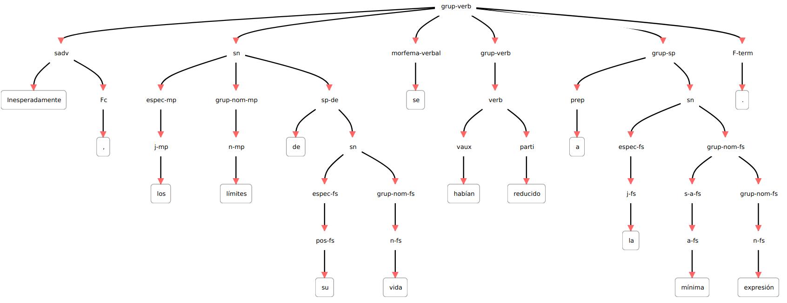


(label_intro)=
Minería de textos y procesamiento del lenguaje natural.
===================================

Borja Navarro Colorado


```{admonition} Nota
:class: note
Lee con atención esta sección 2 y la siguiente sección 3. Realiza las lecturas propuestas y finalmente contesta el cuestionario que encontrarás al final de la sección 3. En la clase presencial repasaremos los conceptos teóricos principales y realizaremos la práctica 1. **El plazo para realizar las lecturas y el cuestionario finaliza a las 23:59 del 07/02/2023** (el día anterior a la clase presencial).
```

<!-- [Transparencias de clase](https://docs.google.com/presentation/d/1R049gfFDPNW0Y9VqmqgBuSioGRTLQ_YPzlOg7KUzJQc/edit?usp=sharing) -->

*Minería de textos* es el conjunto de técnicas y herramientas desarrolladas para extraer información de grandes colecciones textuales, tanto información implícita como explícita.

<!-- Extracción de información de grandes volúmenes de textos. Sin estas técnicas no sería posible analizar toda esa información por un humano. Extracción de patrones / información recurrente. -->

Esa información está codificada en **textos**, es decir, en un idioma o lengua. La minería de textos necesita, por tanto, interpretar (en mayor o menor medida) los textos y a partir de esa interpretación extraer la información. La disciplina computacional que idea y desarrolla sistemas para la interpretación lingüística de los textos es el **procesamiento del lenguaje natural** (PLN o NLP por sus siglas en inglés: *Natural Language Processing*), disciplina híbrida entre la lingüística y la computación.

Este primer bloque de la asignatura es una introducción a los conceptos fundamentales del procesamiento del lenguaje natural. Se expondrán los principales problemas a los que se enfrenta y métodos de resolución, así como herramientas y recursos disponibles para la minería de textos.

<!--Muchos de los conceptos y problemas presentados en este bloque serán recurrentes a lo largo de toda la asignatura, y en algunos de ellos se profundizará en los siguientes módulos.-->

## Qué es un texto (y por qué es difícil su procesamiento automático).

La información de un texto está codificada en signos. El sistema que especifica cómo son esos signos, cómo se combinan y cómo se intepretan es el "idioma" o "lengua". El ser humano que conoce el idioma en que está codificado el texto está capacitado para interpretarlo. Esta interpretación va desde la percepción visual de los signos (letras) hasta la acción o reacción provocada por esa información. Este proceso podemos esquematizarlo en cuatro pasos:

1. Reconocimiento visual o auditivo (lectura o escucha) de los signos lingüísticos (palabras, frases, etc.)
2. Procesamiento sintáctico: cómo se combinan esos signos dentro del texto.
3. Procesamiento semántico: qué signficado asumen los signos teniendo en cuenta el resto de signos y el contexto comunicativo.
4. Reacción: cómo actúa el ser humano a partir de la interprtación del texto (reir un chiste, asimilar información, cerrar una ventana, saludar... o no hacer nada.)

Para este proceso los ordenadores necesitan, sin embargo, algoritmos complejos.

A continuación se presentan algunos de los principales problemas a los que se enfrenta la máquina para interpretar un texto. Para el ser humano pueden resutar "fáciles" (de hecho muchos seres humanos no son capaces de ver el problema interpretativo), pero al ordenador le generan bastantes problemas.

- Ambigüedad. Es el principal problema. Aquí un caso de ambigüedad léxica (luego se verán más casos de ambigüedad):
    + "Te espero en el _banco_." | ¿Qué es "banco" en esta oración?, ¿qué otros significados puede tener la palabra "banco"?

- Vaguedad:
    + "Tu hermano es todavía muy *joven*" |  ¿A qué edad se deja de ser joven?
    + "*Pasados unos días* llegamos a nuestro destino" | ¿Cuántos días? ¿Cuándo llegaron?

- Conocimiento del mundo, conocimiento implícito y sentido común:
    + Visualiza la siguiente conversación entre un humano y un ordenador (HAL 9000) e intenta deducir qué información implícita (conocimiento del mundo, etc.) debe asumir el ordenador para poner entenderse con el humano: <https://www.youtube.com/watch?v=Mme2Aya_6Bc>

- Implicaciones:
    + "Oí ronquidos y decidí no encender la luz" | ¿Qué tiene que ver la luz con los ronquidos?

- Metáforas y usos simbólicos del lenguaje: la metáfora NO es solo un fenómeno literario, sino un mecanismo básico de cognición humana (Lakoff y Johnson 1980). Es muy común, por ejemplo, utilizar metafóricamente términos concretos para hablar de cuestiones abstractas, como en estos casos:
    + "Deja de _perder el tiempo_ y ponte a estudiar" | Tiempo :=:  dinero
    + "A ver si se te _mete_ esto en la cabeza de una vez" | Mente :=: objeto hueco que se puede llenar

- Denotación y emociones: junto a su significado denotativo (el del diccionario, el concepto prototípico asociado a la palabra), las palabras pueden transmitir un abanico de significados connotativos: asociaciones socio-culturales relacionadas con la palabra.
    + "Por fin en _casa_" | casa =  "Edificio para habitar" (RAE), pero también "hogar, familia, lugar entrañable, seguridad, acogimiento, tranquilidad, descanso, reposo, etc..."

- ...

## Niveles de descripción lingüística.

Para estudiar las lenguas en toda su complejidad, los lingüistas las han seccionado en diferentes niveles llamados *niveles de descripción lingüística*. El PLN se basa en estos niveles para desarrollar sus sistemas.

En un proceso interpretativo[¹] (del texto a la interpretación), los niveles de descripción lingüística son los siguientes:

### Imagen o sonidos extralingüístico.

Percepción por la vista (tipografía) o el oído (fonética). Detección de que la imagen o sonido es un objeto lingüístico y por tanto puede ser interpretado, y separación del resto de imágenes/sonidos no lingüísticos (ruido).

### Nivel fono-fonológico.

Percepción y representación mental (prototípica y abstracta) de los sonidos (o su imágenes tipográficas correspondiente). Sistema fonológico basado en rasgos articulatorios mediante oposiciones: modo de articulación (vocales y consonantes), punto de articulación (bilabial, labiodental, interdenta, nasal, palatal, velar, etc.) y vibración de las cuerdas vocales (sonoras - sordas).

Los sistemas de PLN de este nivel son los sistemas de reconocimiento del habla o análisis de voz. El primero transforman una cadena de sonido hablado en una representación textual procesable (texto digital codificado en UTF-8, etc.).

Esta tarea se denomina "Automatic Speech Recognition". Algunos de los problemas que trata de resolver son:

- discriminación del habla de otros tipos de sonidos (ruido);
- separar la cadena sonora (audio) en palabras u otras unidades significativas (sílabas, etc.)
- relacionar sonidos lingüísticos con su fonema correspondiente;
- detectar y procesar la entonación;
- ....

Por ejemplo, al hablar decimos todas las palabras juntas. ¿Sabrías separar la siguiente cadena para que sea una oración gramatical? (Hay dos soluciones según se separen las letras)

Ej. "leasinvergüenza"

El proceso contrario, del texto a habla, son los sistemas de síntesis de voz.

Esta tarea no será tratada en este curso. Si quieres más información, consulta el capítulo 16 del libro de Jurafsky y Martin (2022) *Speech and Language Processing*, disponible en línea: <https://web.stanford.edu/~jurafsky/slp3/16.pdf> (lectura de ampliacón OPCIONAL. No entra en evaluación).

### Nivel morfológico.

En nivel morfológico se estudian y analizan las palabras como unidad lingüística básica. Se analizan sus elementos constitutivos (lexemas, morfemas, etc.), los tipos de palabras según su comportamiento gramatical (nombre, verbo, adjetivo, etc.), así como otro fenómenos lingüísticos como derivación, composición, etc.

En PLN, este nivel está relacionado con uno de los tipos de análsis más importantes: el análisis categorial o *Part of Speech taggers* (*PoS_taggers*). Todo sistema de PLN tiene como mínimo un *PoS tagger*. Estos sistemas suelen realizar cuatro tareas:

1. tokenización: separación de la cadena en *tokens*;
2. lematización: especificación del lema o forma no marcada del *token*;
3. análisis morfológico: *stemmers*, separación de lexemas y morfemas, especificación de rasgos morfológicos...;
4. análisis categorial: clasificación de palabras según la categoría gramatical (nombre, verbo, adjetivo, etc).

Por ejemplo, dada la siguiente oración:

> "Inesperadamente, los límites de su vida se habían reducido a la mínima expresión."

un *PoS tagger* ofrece la siguiente salida (ID|Token|Lema|Categoría gramatical|Categoría gramatical abreviada|Análisis morfológico):

    1  Inesperadamente inesperadamente RG      RG  pos=adverb|type=general
    2  ,               ,               Fc      Fc  pos=punctuation|type=comma
    3  los             el              DA0MP0  DA  pos=determiner|type=article|gen=masculine|num=plural
    4  límites         límite          NCMP000 NC  pos=noun|type=common|gen=masculine|num=plural
    5  de              de              SP      SP  pos=adposition|type=preposition
    6  su              su              DP3CSN  DP  pos=determiner|type=possessive|person=3|gen=common|num=singular|possessornum=invariable
    7  vida            vida            NCFS000 NC  pos=noun|type=common|gen=feminine|num=singular
    8  se              se              P00CN00 P0  pos=pronoun|gen=common|num=invariable
    9  habían          haber           VAII3P0 VAI pos=verb|type=auxiliary|mood=indicative|tense=imperfect|person=3|num=plural
    10 reducido        reducir         VMP00SM VMP pos=verb|type=main|mood=participle|num=singular|gen=masculine
    11 a               a               SP      SP  pos=adposition|type=preposition
    12 la              el              DA0FS0  DA  pos=determiner|type=article|gen=feminine|num=singular
    13 mínima          mínimo          AQ0FS00 AQ  pos=adjective|type=qualificative|gen=feminine|num=singular
    14 expresión       expresión       NCFS000 NC  pos=noun|type=common|gen=feminine|num=singular
    15 .               .               Fp      Fp  pos=punctuation|type=period

En el tema siguiente se expondrán los principales problemas y métodos del análisis categorial.

### Nivel sintáctico

En uno texto, las palabras no están aisladas, sino relacionadas unas con otras dentro de la oración. En el nivel sintáctico se estudian y analizan esas relaciones entre las palabras. Las palabras se agrupan así en constituyentes superiores (sintagmas) y establecen relaciones jerárquicas (dependencias) entre ellas. Estas relaciones determinan el significado final de la oración y del texto.

En PLN, los sistemas que realizan el análisis sintáctico reciben el nombre genérico de *parser* (por influencia de los compiladores). Dada una oración, el *parser* devuelve un árbol sintáctico. Por ejemplo, dada la oración anterior, tendremos esto:



El principal problema que debe resolver un *parser* es la ambigüedad estructural: oraciones de las que es posible derivar dos o más árboles. Analiza la siguiente oración. ¿Sabrías decir quién tiene los prismáticos?

> "Vi a tu hermano con los prismáticos."

Efectivamente, "con los prismáticos" puede ser tanto complemento del verbo (y por tanto quien tiene los prismáticos es el "yo" sujeto) como complemento del nombre "hermano" (en cuyo caso es el hermano quien tiene los prismáticos).

En el próximo tema se verá con más detalle los formalismos de análisis sintáctico y los principales métodos de análisis.

### Nivel semántico

En el nivel semántico se trata todo aquello relacionado con el significado del texto. Aquí se pueden tratar muchos aspectos lingüísticos, de los cuales hay dos predominantes: la semántica léxica y la semántica oracional.

La **semántica léxica** es la parte de la semántica centrada en el significado de las palabras. En PLN hay una tarea específica para el análisis del significado de las palabras denominado *word sense disambiguation* (WSD). En su forma más simple, un sistema de WSD es aquél que, dada una palabra con varios significados, decide cuál es el significado correcto en un contexto dado. Ese caso, en el que una palabra tiene varios significados (polisemia u homonimia) pero solo uno es el apropiado en un contexto determinado, se denomina **ambigüedad léxica**. Es la ambigüedad que aparece en la oracion antes comentada:

> Te espero en el *banco*.

Actualmente, con el desarrollo de los modelos neuronales y el *deep learning*, hay otros métodos de análisis léxico-semántico capaces de inferir el significado de una palabra a partir del contexto (significado distribucional). Y hay un tercer caso, más complejo, en el que las palabras se utilizan en contextos que no le son propios: son los usos metafóricos y, en general, simbólicos. En estos casos, se considera que la palabra tiene un significado "no lexicalizado" porque no está considerado en un diccionario.

La **semántica oracional** se centra el el significado que asume la oración en su conjunto. Este se basa en el principio de composicionalidad, según el cual el significado de la oración está en función del signficado de las palabras y de las relaciones que se establecen entre ellas. En este ámbito se han desarrollado diferentes modelos formales como la representación lógica, los roles semánticos, la semántica de eventos, entre otros.

El siguiente ejemplo muestra un análisis de roles semánticos de la oración "Inesperadamente, los límites de su vida se habían reducido a la mínima expresión.", codificado en XML. El atributo "role" especifica el rol semántico que asume cada argumento (etiqueta "argument") en la oración.

    <predicate head_token="t1.10" id="P1.1" sense="reducir.00" words="reducido">
        <argument from="t1.1" head_token="t1.1" role="AM-MNR" to="t1.2" words="Inesperadamente ,"/>
        <argument from="t1.3" head_token="t1.4" role="A1" to="t1.7" words="los límites de su vida"/>
        <argument from="t1.11" head_token="t1.11" role="A2" to="t1.14" words="a la mínima expresión"/>
    </predicate>

En el siguiente tema se profundizará sobre todo en la semnántica léxica. Se verán, por un lado, los principales métodos de *word sense disambiguation* y, por otro, los modelos semánticos distribucionales, que son la base lingüística de los actuales "word embeddings".

### Nivel textual

La comunicación no se realiza mediante palabras u oraciones, sino mediante textos. En lingüística el texto es la principal unidad comunicativa. En este nivel se estudian todos aquellos fenómenos lingüísticos que superan el límite oracional, como puede ser marcas de conexión entre oraciones o secciones, correferencias y anáforas (palabras que se interpretan por su relación con una palabra anterior, como ocurre por ejemplo con los pronombres), coherencia general del texto, temas... 

La resolución de la correferencia es quizá de los más interesantes para Minería de textos por su relación con la extracción de entidades. El problma surge cuando se hace referencia a una entidad (a una persona, por ejemplo), no con el nombre que le es propio, sino con un pronombre u otra forma lingüística. Fíjate, por ejemplo, en las palabras "que", "le" y "su" de la siguiente oración: ¿cuál es su significado?

> "Juan había ido elaborando una ruta perfecta de bares *que* *le* permitía ver *su* programa favorito".

Estas palabras no tienen significado por sí mismas, sino que lo asumen en la oración por la relación que establecen con palabras anteriores (el llamado "antecedente"). Así, "que" se refiere a "ruta", y "le" y "su" a "Juan". Los sistemas de resolución de la correferencia tratan este problema.

Otro tema relevante en el nivel textual que ha tenido mucho desarrollo en la última década es la inferencia de temas: dado un conjuto de textos, determinar los temas (o *topics*) presentes en cada texto. Esta tarea ha recibido el nombre genérico de *topic modeling* y se suelen utiliza algorirmos basados en [*Latent Dirichlet Allocation*](https://es.wikipedia.org/wiki/Latent_Dirichlet_Allocation) o LDA. En próximas semanas realizaremos una práctica con *topic modeling*.

### Nivel pragmático

La comunicación, por último, no se produce de manera aislada, sino dentro de una situación comunicativa donde aparece una persona que crea el texto, otra que lo interpreta, un contexto o situación, una intención, etc. Todos estos aspectos, que se sitúan ya fuera del texto, entran dentro del nivel pragmático.

Algunos fenómenos lingüísticos que requieren tener en cuenta la situación pragmática:

- Referencias de lugar ("aquí"), temporales ("hoy") o personales ("tú"), así como referencias concretas ("este libro").
- Actos de habla: el propio acto de hablar (locutivo), la intención por la que se habla (afirmas, agradecer, insultar, opinar, etc.), llamado acto "ilocutivo", y las consecuencias del acto en el receptor (perlocutivo). Algunos asistentes de voz como SIRI son capaces de detectar las intenciones del hablante (el acto "ilocutivo") y contestar en consecuencia:

> USUARIO: "¿Puedo darte un beso?"
> SIRI: "¿Qué tal si busco “comportamiento inapropiado” en Internet?"

- Sentimientos y emociones expresados en el texto (si bien este punto podría considerarse también semántico).
- Intención del hablante: detecta el humor, la ironía... Y tambien bulos, engaños, mentiras; o técnicas de persuasión, etc.
- Agentes conversacionales y gestión del diálogo para sistemas de diálogo.
- etc.

Y en general en este nivel se tratan todas las aplicaciones del PLN a tareas concretas, como se verá en próximos temas.

## Métodos de PLN.

Si bien las primeras propuestas de aplicar métodos computacionales al texto datan de los años 40 (con el nacimiento de la teoría de los lenguajes formales), no es hasta los 70 cuando empiezan a aparecer los primeros sistemas de PLN (SHRDLU de Winograd, 1972). Desde los primeros años se establecieron dos formas de abordar computacionalmente los fenómenos lingüísticos, dos métodos generales: los métodos simbólicos y los métodos estadísticos.

### Métodos simbólicos (basados en el racionalismo):

Estos métodos intentan describir el funcionamiento del idioma (en cualquiera de sus fenómenos y niveles) mediante **reglas formales**. En general, tratan de formalizar nuestro conocimiento de la gramática de un idioma con reglas que la máquina pueda entender.

Este paradigma fue predominante en los años 80. Hoy día, si bien en investigación apenas tiene presencia (es raro encontrar artículos que presenten sistemas simbólicos), en la industria sigue siendo un paradigma utilizado. Los sistemas de PLN de muchas empresas dependen de gramáticas y otros recursos lingüísticos (diccionarios) que se crean y mantienen a mano por expertos (lingüistas).

La gran ventaja de los métodos simbólicos es su precisión. Permite tratar fenómenos lingüísticos muy concretos. Adolecen, sin embargo, de cobertura, pues es complejo (por no decir imposible) prever y tratar todos los fenómenos lingüísticos que puede haber en un texto mediante reglas explícitas.

### Métodos estadísticos (basados en el empirismo).

La aplicación de métodos estadísticos al procesamiento lingüístico tuvo especial desarrollo a partir de los años 90 del siglo XX. Hoy día estos métodos siguen los modelos de aprendizaje automático: supervisado, no supervisado y semi-supervisado. Dependen por tanto de la disponibiliad de corpus: un conjunto de muestras lingüísticas. Estos corpus bien pueden ser corpus de aprendizaje o entrenamiento, o bien corpus de evaluación (los llamados *gold standard*).

Los corpus pueden ser básicamente de dos tipos:

- corpus planos (*plain*), si ningún tipo de marca, etiqueta o anotación, donde se muestra el idioma tal cual es, tal cual lo utilizan los hablantes.
- corpus anotados, en los que se introducen etiquetas formales que representan el conocimiento lingüístico. Este conocimiento (fonético, morfológico, sintáctico, semántico o pragmático) está en principio implícito en el texto, y con la etiquetas se hace explícito.

Los corpus anotados son la fuente de información principal para los procesos de aprendizaje supervisado. Las tareas que se desarrollan con estos métodos son:

- especificar y sistematizar el fenómeno lingüístico
- formalizar y representar en el corpus sin ambigüedades
- seleccionar el algoritmo apropiado para la detección del fenómeno y su clasificación según sus rasgos.

### Métodos neuronales

Hoy día, sin embargo, la más común en PLN es utilizar métodos neuronales o *deep learning*. Aunque se podrían considar un tipo de método estadístico, su desarrollo y complejidad hacen que sean tratados como un tipo metodológico diferente. Muchos de los métodos neuronales en realidad fueron diseñados en los años 70 y 80 del siglo XX, pero no ha sido hasta el siglo XXI en que, gracias a la capacidad de cómputo de las maquinas, se han podido aplicar a grandes corpus.

La aproximación de los modelos neuronales es diferente de los modelos estadísticos, digamos, "clásicos". En vez de proponer un modelo matemático más o menos complejo con un diseño de rasgos (*features*) sofisiticado, los modelos neuronales proponen modelos matemáticos más o menos simples, como puede ser una función sigmoide (la "neurona", aunque ya  nada tiene que ver con la mente humana), pero repetido muchas veces (las capas ocultas y profundas: *deep*). Unido a una representación del significado mediante vectores contextuales de tamaño fijo (los *word embeddings*), los modelos neuronoales han supuesto una revolución metodologica en el PLN en particular y en la Inteligencia Artifical en general.

Efectivamente, hay áreas donde los modelos neuronales han hallado la solución a problemas complejos. En el caso del PLN, los sistemas de análisis de voz funcionan prácticamente ya sin problemas gracias a estos modelos, por no hablar de la mejora significativa de los sistema de traducción automática y, desde hace unos meses, la espectacularidad de sistemas de generación textual como [chatGPT](https://chat.openai.com/). El PLN en general, sin embargo, aún presenta muchos problemas irresolubles (Manning 2015), lo cual quizá sea la mayor prueba de la complejidad del análisis lingüístico.

En este primer tema veremos sobre todo métodos simbólicos y estadísticos; para luego, en siguientes temas, profundizar en los métodos neuronales.

## Conclusión y bibliografía

En esta sesión se ha presentado una panorámica del Procesamiento del Lenguaje Natural. Se han enunciado los principales problemas que tiene procesar un texto y los principales métodos. En el resto de la asignatura se irá profundizando tanto en (algunos de) los problemas como en los métodos; con el objetivo simpre de saber cómo procesar un texto para la extracción de datos.

El principal manual de PLN, que utilizaremos en varios temas de esta asignatura, es el libro de Jurafsky y Martin (2022) *Speech and Language Processing*. <https://web.stanford.edu/~jurafsky/slp3/>.

Una introducción más ligera al PLN, sobre todo para estudiantes sin conocimientos de informática, es el libro de Bird, Klein y Loper (2009) *Natural Language Processing with Python. Analyzing Text with the Natural Language Toolkit* O'Reilly Media. https://www.nltk.org/book_1ed/

Para los modelos estadísticos, la referencia principal sigue siendo el libro de Manning y Schütze (1999) [*Foundations of Statistical Natural Language Processing*](https://nlp.stanford.edu/fsnlp/), MIT Press, si bien no trata modelos neuronales y en algunos temas ha quedado desfasado.

En esta línea, pero totalmente actualizado, es recomendable el libro de Jacob Eisenstein (2018) [*Natural Language Processing*](https://raw.githubusercontent.com/jacobeisenstein/gt-nlp-class/master/notes/eisenstein-nlp-notes.pdf).

Además de las tareas de procesamiento lingüístico básico aquí comentadas, el PLN tiene definidas otras tareas que puedes ver en <http://nlpprogress.com/>.

Otras referencias citadas en esta sección:

- Lakoff y Johnson (1980) *Metáforas de la vida cotidiana* Madrid, Cátedra, 1986.
- Manning, Christopher D. (2015) "Computational Linguistics and Deep Learning" *Computational Linguistics* 41 (4) p.701-707
- Schubert, Lenhart, "Computational Linguistics", *The Stanford Encyclopedia of Philosophy* (Spring 2020 Edition), Edward N. Zalta (ed.), https://plato.stanford.edu/archives/spr2020/entries/computational-linguistics/ 


<!--
### Actividad para pensar:

Consulta las siguientes oraciones e intenta determinar qué tipo de ambigüedad tienen:

[Formulario *Caos de Ambigüedad*](https://docs.google.com/forms/d/e/1FAIpQLSekRufl7AoUu4z0kSxa2ZkCoYzd9pNzyaIxtCJN7ZBFOC7U2A/viewform?usp=sf_link)

-->


[¹] En proceso contrario sería la generación: de la idea al texto.
